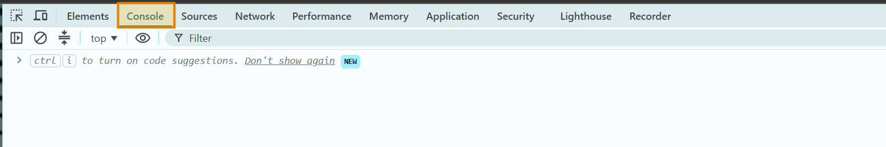
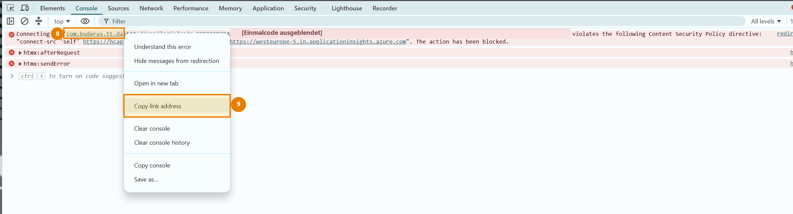

# Einrichtung für Einsteiger

Diese Anleitung führt Schritt für Schritt durch Installation und Anmeldung.
Vorkenntnisse mit OAuth, APIs oder der PointT Cloud API sind nicht nötig.

**Bosch/Buderus Heating** verbindet kompatible Bosch- und Buderus-Heizsysteme
über die PointT Cloud API mit Home Assistant. Nach der Einrichtung werden die
gefundenen Geräte und Entitäten automatisch in Home Assistant angelegt.

## Was du benötigst

- eine kompatible Bosch- oder Buderus-Heizung mit MX300, MX400, K30/K30RF,
  K40/K40RF oder einem kompatiblen PointT-Gateway;
- ein funktionierendes SingleKey-ID-Konto, das bereits mit der Heizungs-App
  verbunden ist;
- ein Home-Assistant-Benutzerkonto mit Administratorrechten;
- einen Computer mit einem aktuellen Browser;
- ungefähr zehn Minuten Zeit.

Dein SingleKey-ID-Passwort wird ausschließlich auf der offiziellen
SingleKey-ID-Seite eingegeben. Home Assistant und diese Integration fragen das
Passwort nicht ab.

## Installation mit HACS

### HACS ist noch nicht installiert?

1. Öffne die offizielle
   [HACS-Installationsanleitung](https://www.hacs.xyz/docs/use/download/download/).
2. Wähle dort deine Home-Assistant-Installationsart aus und führe die
   beschriebenen Schritte aus.
3. Starte Home Assistant anschließend neu.
4. Öffne **Einstellungen → Geräte & Dienste → Integration hinzufügen** und
   suche nach **HACS**.
5. Wähle **HACS** und schließe die angezeigte GitHub-Anmeldung ab.

Danach erscheint HACS in der Home-Assistant-Seitenleiste.

### Bosch/Buderus Heating installieren

HACS informiert dich später automatisch über verfügbare Updates.

1. Öffne in Home Assistant **HACS**.
2. Gib oben im Feld **Durchsuchen** den Namen
   **Bosch/Buderus Heating** ein.
3. Öffne den Treffer **Bosch/Buderus Heating**. Verwechsle ihn nicht mit
   anderen Bosch- oder Buderus-Projekten im HACS-Katalog.
4. Wähle **Herunterladen**.
5. Bestätige die vorgeschlagene aktuelle Version.
6. Starte Home Assistant vollständig neu, sobald HACS dazu auffordert.

> [!NOTE]
> Der Download in HACS installiert zunächst nur die benötigten Dateien. Erst
> nach dem Neustart wird **Bosch/Buderus Heating** wie im nächsten Abschnitt
> unter **Einstellungen → Geräte & Dienste** eingerichtet.

#### Das Repository erscheint noch nicht in der HACS-Suche

Falls **Bosch/Buderus Heating** noch nicht in den allgemeinen HACS-Katalog
aufgenommen wurde, kann dasselbe veröffentlichte Repository trotzdem sicher
über HACS installiert und aktualisiert werden:

1. Öffne **HACS**.
2. Öffne oben rechts das Menü mit den drei Punkten **⋮**.
3. Wähle **Benutzerdefinierte Repositories** beziehungsweise
   **Custom repositories**.
4. Trage als Repository
   `https://github.com/SoftwareSchmied/ha-bosch-buderus-heating` ein.
5. Wähle als Typ **Integration**.
6. Wähle **Hinzufügen** beziehungsweise **Add**.
7. Suche anschließend im HACS-Dashboard nach **Bosch/Buderus Heating** und
   führe die oben beschriebenen Download-Schritte aus.

Dieser Zusatzschritt ist nur erforderlich, solange das Projekt noch nicht im
allgemeinen HACS-Katalog erscheint. Verwende ausschließlich die oben genannte
Repository-Adresse.

## Integration hinzufügen

1. Öffne in Home Assistant **Einstellungen**.
2. Gehe zu **Geräte & Dienste** und öffne **Integrationen**.
3. Wähle unten rechts **Integration hinzufügen**.

*Die Schaltfläche befindet sich unten rechts. Je nach eingestellter Sprache
steht dort „Integration hinzufügen“ oder „Add integration“.*

4. Suche nach **Bosch/Buderus Heating**.
5. Bestätige die Rückfrage von Home Assistant mit **OK**.

6. Wähle die Marke der Smartphone-App, mit der deine Heizung bereits verbunden
   ist:

   - **Bosch**, wenn du die Bosch-App verwendest;
   - **Buderus**, wenn du die Buderus-App verwendest.

Entscheidend ist die verwendete App. Das Logo auf Wärmepumpe oder Inneneinheit
allein reicht für die Auswahl nicht aus.

## Mit SingleKey ID anmelden

Home Assistant zeigt nun einen Link **SingleKey ID** und darunter ein leeres
Eingabefeld an.

**SingleKey ID ist dieselbe Anmeldung, die auch die Bosch- beziehungsweise
Buderus-App verwendet.** Melde dich mit derselben E-Mail-Adresse oder
Mobilnummer und demselben Passwort an wie in deiner Heizungs-App. Du benötigst
kein neues Konto und vergibst für Home Assistant kein zusätzliches Passwort.
Der Link im Einrichtungsdialog wird für jeden Anmeldeversuch neu erzeugt und
muss deshalb immer direkt dort geöffnet werden.

*Die Anmeldeseite kann abhängig von Marke, Bildschirmgröße und Sprache etwas
anders aussehen. Gib die E-Mail-Adresse oder Mobilnummer deines bestehenden
SingleKey-ID-Kontos ein.*

Die folgende Vorgehensweise wurde mit Google Chrome geprüft. Öffne die
Entwicklertools bereits vor der Anmeldung, damit Chrome die benötigte
Rückgabeadresse anzeigt:

1. Lasse den Home-Assistant-Dialog geöffnet.
2. Öffne den dort angezeigten Link **SingleKey ID** in einem neuen Chrome-Tab.
3. Drücke in diesem SingleKey-ID-Tab `F12`.
4. Wähle oben in den Entwicklertools **Console** beziehungsweise **Konsole**.

   

   *Der orange markierte Tab **Console** kann in einer deutschsprachigen
   Chrome-Version **Konsole** heißen.*

5. Melde dich mit demselben SingleKey-ID-Konto an, das du für die Heizungs-App
   verwendest.
6. Bestätige alle erforderlichen Anmeldeschritte.
7. Nach der Anmeldung kann die Meldung **Haben Sie Netzwerkprobleme? Die Anfrage
   konnte nicht abgeschlossen werden.** erscheinen. In diesem Fall ist die
   Internetverbindung normalerweise nicht gestört. Chrome konnte lediglich die
   Rückgabeadresse der Smartphone-App nicht öffnen.
8. Suche unten in der Konsole die rote Meldung mit der blau dargestellten
   App-Adresse. Abhängig von der Chrome-Version beginnt sie mit **Failed to
   launch** oder **Connecting to**.
9. In dieser Meldung steht eine lange, blau dargestellte Adresse. Sie beginnt
   abhängig von der gewählten Marke mit einem dieser Werte:

   - Bosch: `com.bosch.tt.dashtt.pointt://app/login?code=...`
   - Buderus: `com.buderus.tt.dashtt://app/login?code=...`

   

   *Die Markierungen **8** und **9** zeigen die App-Adresse und den richtigen
   Eintrag im Kontextmenü. Der Einmalcode wurde im Screenshot ausgeblendet.*

10. Klicke mit der rechten Maustaste auf diese blaue Adresse.
11. Wähle **Linkadresse kopieren** beziehungsweise **Copy link address**.
12. Wechsle zurück zum weiterhin geöffneten Home-Assistant-Tab.
13. Füge die kopierte vollständige Adresse mit `Strg+V` in das Feld
    **Vollständige Weiterleitungsadresse** ein.
14. Das Feld zeigt aus Sicherheitsgründen möglicherweise nur Punkte an. Das ist
    beabsichtigt.
15. Prüfe nur, dass du die vollständige Adresse und nicht lediglich den Wert
    hinter `code=` kopiert hast.
16. Wähle **OK**.

Falls die Konsole keine Meldung enthält, beginne die Anmeldung mit geöffneten
Entwicklertools erneut. Verwende immer die Rückgabeadresse aus demselben
Anmeldeversuch wie der noch geöffnete Home-Assistant-Dialog. Eine Adresse aus
einem älteren Versuch wird aus Sicherheitsgründen abgelehnt.

> [!IMPORTANT]
> Die Weiterleitungsadresse enthält einen kurzlebigen Einmalcode. Veröffentliche
> sie niemals in einem GitHub-Issue, Chat, Screenshot oder Protokoll.

## Gateway auswählen

Nach erfolgreicher Anmeldung fragt Home Assistant die Gateways des Kontos ab.

1. Wähle alle Gateways aus, die Home Assistant verwenden soll.
2. Gibt es nur einen Eintrag, wähle diesen Eintrag aus.
3. Bei mehreren ähnlich benannten Gateways helfen die letzten vier angezeigten
   Zeichen bei der Unterscheidung.
4. Wähle **Senden**.

Anschließend erscheint **Bosch/Buderus Heating** als eingerichtete Integration.
Die erkannten Heizgeräte und ihre Entitäten findest du über den Eintrag
**Geräte** auf der Integrationskarte. Von dort können sie Bereichen und
Dashboards zugeordnet werden.

## Aktualisieren

Bei einer Installation über HACS wird eine neue Version in Home Assistant
angezeigt. Öffne den Hinweis, lies die Versionshinweise und wähle
**Aktualisieren**. Starte Home Assistant neu, wenn HACS dazu auffordert.

## Häufige Probleme

### Nach der Anmeldung erscheint die SingleKey-ID-Startseite

Eine Adresse wie `https://singlekey-id.com/de-de/home` ist nicht das benötigte
Anmeldeergebnis und darf nicht in Home Assistant eingefügt werden.

1. Wechsle zurück zum Home-Assistant-Tab.
2. Öffne im Einrichtungsdialog erneut den dort angezeigten Link
   **SingleKey ID**. Öffne SingleKey ID nicht über ein Lesezeichen oder durch
   manuelle Eingabe der Webadresse.
3. Falls erneut die Startseite erscheint, schließe den Einrichtungsdialog.
4. Füge **Bosch/Buderus Heating** erneut hinzu und wiederhole die Anmeldung mit
   dem neu erzeugten Link.

### Der Browser öffnet direkt die Heizungs-App

Kehre zum Browser zurück und wiederhole die Anmeldung am Computer. Wenn der
Browser vor dem Öffnen der App nachfragt, wähle **Abbrechen**. Öffne vor dem
nächsten Versuch mit `F12` die Konsole. Kopiere anschließend aus der roten
Meldung **Failed to launch** beziehungsweise **Connecting to** die vollständige
`com.bosch...://`- oder `com.buderus...://`-Adresse wie oben beschrieben.

### Home Assistant meldet eine ungültige Weiterleitungsadresse

- Prüfe, ob die komplette Adresse eingefügt wurde.
- Verwende keine Adresse aus einem älteren Anmeldeversuch.
- Starte die Einrichtung neu, wenn die Anmeldung längere Zeit offen war.
- Achte darauf, dass Bosch beziehungsweise Buderus zur verwendeten App passt.

### Der PointT-Dienst ist nicht erreichbar

Prüfe die Internetverbindung von Home Assistant und warte kurz. Zeigt Home
Assistant **Gateway-Suche wiederholen**, genügt ein erneuter Klick auf
**Senden**; eine neue Anmeldung ist nicht nötig.

### Es wird kein Gateway gefunden

- Öffne die offizielle Heizungs-App und prüfe, ob die Anlage dort online ist.
- Prüfe, ob du das richtige SingleKey-ID-Konto verwendet hast.
- Prüfe die ausgewählte Marke.
- Vergleiche das Gateway mit der Kompatibilitätsliste im README. Ist es dort
  aufgeführt, erstelle einen Fehlerbericht wie unten beschrieben.

### Die Integration wird bei der Suche nicht angezeigt

Unterscheide zuerst, an welcher Stelle die Suche fehlschlägt:

- **Nicht in HACS gefunden:** Füge das Projekt wie unter
  [Das Repository erscheint noch nicht in der HACS-Suche](#das-repository-erscheint-noch-nicht-in-der-hacs-suche)
  beschrieben als benutzerdefiniertes Repository hinzu.
- **In HACS heruntergeladen, aber nicht unter „Integration hinzufügen“
  gefunden:** Starte Home Assistant vollständig neu. Prüfe anschließend unter
  **Einstellungen → System → Protokolle**, ob ein Ladefehler für
  `bosch_buderus_heating` angezeigt wird.

## Hilfe anfordern

Entferne vor dem Teilen von Diagnoseinformationen immer folgende Daten:

- Weiterleitungsadressen und OAuth-Codes;
- Zugriffs- und Aktualisierungstokens;
- Gateway-IDs, Seriennummern und Netzwerkkennungen;
- E-Mail-Adressen und andere Kontodaten.

Die Regeln für sichere Diagnoseinformationen stehen in
[Datenschutz und Testdaten](privacy-and-fixtures.md).

Fehlerberichte und Funktionswünsche können im
[GitHub-Issue-Tracker](https://github.com/SoftwareSchmied/ha-bosch-buderus-heating/issues)
erstellt werden. Beschreibe Home-Assistant-Version, Integrationsversion,
Gateway-Modell und die genaue Fehlermeldung, ohne die oben genannten geheimen
oder persönlichen Daten anzuhängen.
