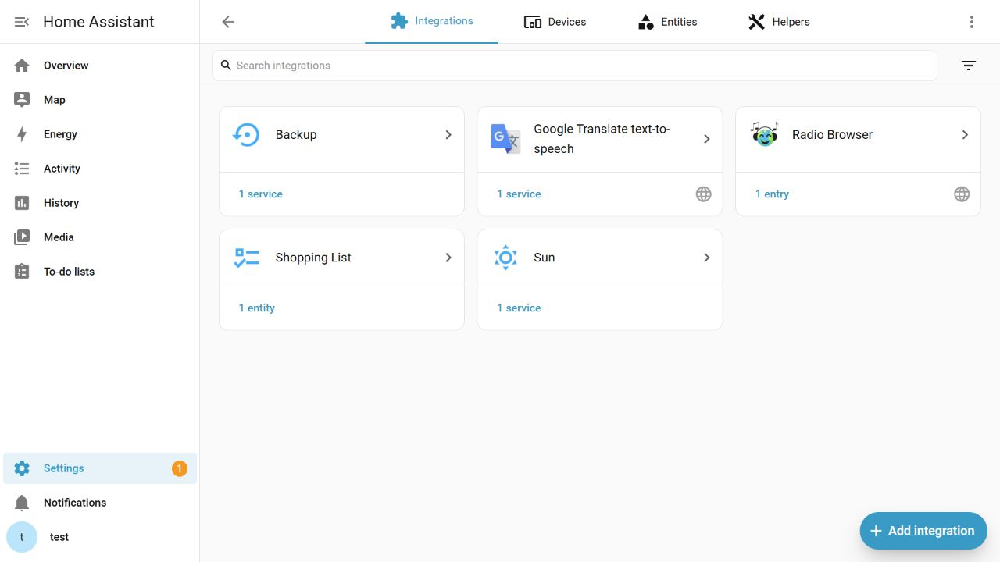
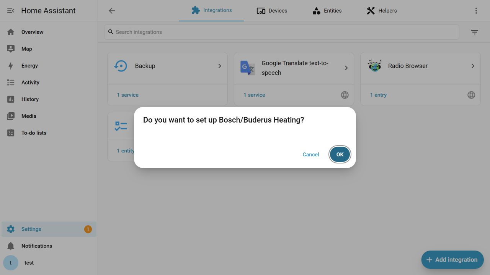
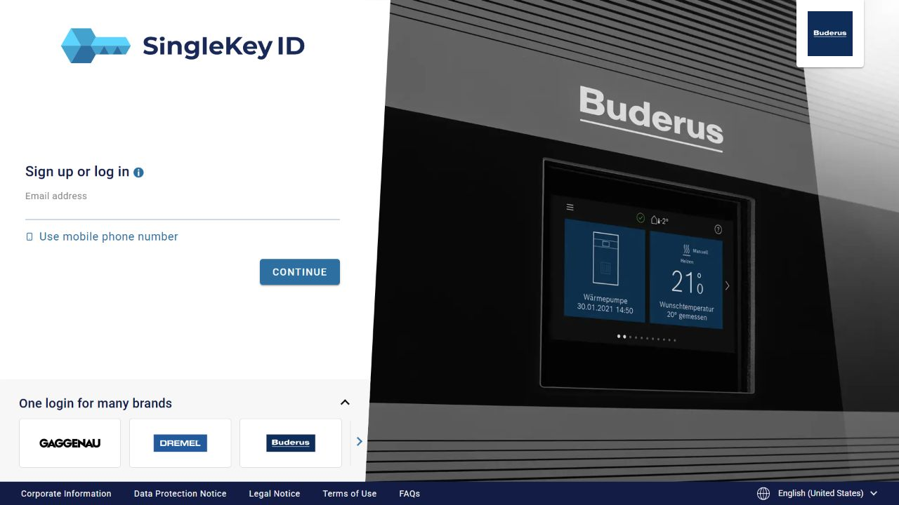
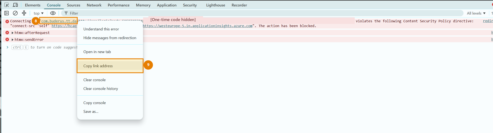

# Setup guide

This guide walks through installation and sign-in step by step. No previous
knowledge of OAuth, APIs, or the PointT Cloud API is required.

**Bosch/Buderus Heating** connects compatible Bosch and Buderus heating systems
to Home Assistant through the PointT Cloud API. After setup, detected devices
and entities are created automatically in Home Assistant.

## Requirements

- a compatible Bosch or Buderus heating system with an MX300, MX400, K30/K30RF,
  K40/K40RF, or another compatible PointT gateway;
- a working SingleKey ID account that is already connected to the heating app;
- a Home Assistant user account with administrator permissions;
- a computer with a current web browser;
- about ten minutes.

Enter the SingleKey ID password only on the official SingleKey ID website.
Neither Home Assistant nor this integration asks for that password.

## Installation with HACS

### HACS is not installed yet

1. Open the official
   [HACS installation guide](https://www.hacs.xyz/docs/use/download/download/).
2. Select the Home Assistant installation type and follow the instructions.
3. Restart Home Assistant.
4. Open **Settings → Devices & services → Add integration** and search for
   **HACS**.
5. Select **HACS** and complete the GitHub sign-in shown by Home Assistant.

HACS then appears in the Home Assistant sidebar.

### Install Bosch/Buderus Heating

HACS will notify you about future updates.

1. Open **HACS** in Home Assistant.
2. Enter **Bosch/Buderus Heating** in the **Search** field at the top.
3. Open the **Bosch/Buderus Heating** result. Do not confuse it with other
   Bosch or Buderus projects in the HACS catalog.
4. Select **Download**.
5. Confirm the suggested current version.
6. Restart Home Assistant completely when HACS asks you to do so.

> [!NOTE]
> The HACS download installs the required files. **Bosch/Buderus Heating**
> becomes available under **Settings → Devices & services** only after Home
> Assistant has restarted.

#### Repository does not appear in HACS search

Until **Bosch/Buderus Heating** is included in the default HACS catalog, the
same published repository can be installed and updated safely as a custom
repository:

1. Open **HACS**.
2. Open the three-dot menu **⋮** in the upper-right corner.
3. Select **Custom repositories**.
4. Enter
   `https://github.com/SoftwareSchmied/ha-bosch-buderus-heating` as the
   repository.
5. Select **Integration** as the category.
6. Select **Add**.
7. Search for **Bosch/Buderus Heating** in the HACS dashboard and follow the
   download steps above.

This additional step is needed only while the project is not yet in the
default HACS catalog. Use only the repository address shown above.

## Add the integration

1. Open **Settings** in Home Assistant.
2. Go to **Devices & services** and open **Integrations**.
3. Select **Add integration** in the lower-right corner.

*The button is in the lower-right corner.*

4. Search for **Bosch/Buderus Heating**.
5. Confirm the Home Assistant prompt with **OK**.

6. Select the brand of the smartphone app that is already connected to the
   heating system:

   - **Bosch** when using the Bosch app;
   - **Buderus** when using the Buderus app.

The app determines this selection. The logo on the heat pump or indoor unit
alone is not sufficient.

## Sign in with SingleKey ID

Home Assistant now shows a **SingleKey ID** link and an empty input field below
it.

**SingleKey ID is the same account used by the Bosch or Buderus app.** Sign in
with the same email address or mobile number and password as in the heating
app. No new account or additional Home Assistant password is required. The
setup dialog creates a new link for every sign-in attempt, so always open the
link directly from that dialog.

*The page may look slightly different depending on the selected brand, screen
size, and language. Enter the email address or mobile number of the existing
SingleKey ID account.*

The following procedure has been verified with Google Chrome. Open Developer
Tools before signing in so Chrome displays the required redirect address:

1. Keep the Home Assistant setup dialog open.
2. Open its **SingleKey ID** link in a new Chrome tab.
3. Press `F12` in the SingleKey ID tab.
4. Select **Console** at the top of Developer Tools.

   

   *The highlighted **Console** tab may have a localized name in Chrome.*

5. Sign in with the same SingleKey ID account used by the heating app.
6. Complete all required sign-in steps.
7. After sign-in, the page may report **Are you having network problems? The
   request could not be completed.** This normally does not indicate a broken
   internet connection. Chrome was simply unable to open the smartphone app's
   redirect address.
8. Find the red message near the bottom of the Console that contains a blue
   app address. Depending on the Chrome version, it starts with **Failed to
   launch** or **Connecting to**.
9. The message contains a long blue address. Depending on the selected brand,
   it starts with one of these values:

   - Bosch: `com.bosch.tt.dashtt.pointt://app/login?code=...`
   - Buderus: `com.buderus.tt.dashtt://app/login?code=...`

   

   *Markers **8** and **9** identify the app address and the correct context
   menu item. The one-time code is hidden in the screenshot.*

10. Right-click the blue address.
11. Select **Copy link address**. Do not open or send the link.
12. Return to the Home Assistant tab, leaving the setup dialog open.
13. Paste the complete copied address with `Ctrl+V` into **Complete redirect
    address**.
14. For security, the input may display dots instead of the address. This is
    expected.
15. Make sure the complete address was copied, not only the value after
    `code=`.
16. Select **OK**.

If the Console contains no matching message, repeat sign-in while Developer
Tools is open. Always use the redirect address from the same attempt as the
currently open Home Assistant setup dialog. An address from an older attempt
is rejected for security reasons.

> [!IMPORTANT]
> The redirect address contains a short-lived one-time code. Never publish it
> in a GitHub issue, chat, screenshot, or log.

## Select gateways

After successful sign-in, Home Assistant requests the gateways associated with
the account.

1. Select every gateway that Home Assistant should use.
2. If there is only one entry, select that entry.
3. For similarly named gateways, use the displayed last four characters to
   distinguish them.
4. Select **Submit**.

**Bosch/Buderus Heating** now appears as a configured integration. Open
**Devices** on its integration card to find the detected heating equipment and
entities. Devices can then be assigned to areas and dashboards.

## Updating

For a HACS installation, Home Assistant displays an available new version.
Open the notification, read the release notes, and select **Update**. Restart
Home Assistant if HACS requests it.

## Troubleshooting

### SingleKey ID home page appears after sign-in

An address such as `https://singlekey-id.com/en-us/home` is not the required
sign-in result and must not be pasted into Home Assistant.

1. Return to the Home Assistant tab.
2. Open the **SingleKey ID** link shown in the setup dialog again. Do not open
   SingleKey ID from a bookmark or by manually entering its website address.
3. If the home page appears again, close the setup dialog.
4. Add **Bosch/Buderus Heating** again and repeat sign-in with the newly
   generated link.

### Browser opens the heating app

Return to the browser and repeat sign-in on a computer. If the browser asks
before opening the app, select **Cancel**. Before the next attempt, press
`F12` and open the Console. Then copy the complete
`com.bosch...://` or `com.buderus...://` address from the **Failed to
launch** or **Connecting to** message as described above.

### Home Assistant reports an invalid redirect address

- Confirm that the complete address was pasted.
- Do not use an address from an older sign-in attempt.
- Restart setup if the sign-in page remained open for a long time.
- Confirm that the selected Bosch or Buderus brand matches the app.

### PointT service cannot be reached

Check the Home Assistant internet connection and wait briefly. If Home
Assistant displays **Retry gateway discovery**, select **Submit** again; no new
sign-in is required.

### No gateway is found

- Open the official heating app and confirm that the system is online.
- Confirm that the correct SingleKey ID account was used.
- Confirm the selected brand.
- Compare the gateway with the compatibility list in the README. If it is
  listed, create a bug report as described below.

### Integration is not shown in search

First determine where the search fails:

- **Not found in HACS:** add the project as a custom repository as described
  under [Repository does not appear in HACS search](#repository-does-not-appear-in-hacs-search).
- **Downloaded in HACS but missing from Add integration:** restart Home
  Assistant completely. Then check **Settings → System → Logs** for a loading
  error involving `bosch_buderus_heating`.

## Request help

Always remove the following data before sharing diagnostics:

- redirect addresses and OAuth codes;
- access and refresh tokens;
- gateway IDs, serial numbers, and network identifiers;
- email addresses and other account data.

The rules for safe diagnostics are documented in
[Privacy and test data](privacy-and-fixtures.md).

Bug reports and feature requests can be submitted through the
[GitHub issue tracker](https://github.com/SoftwareSchmied/ha-bosch-buderus-heating/issues).
Include the Home Assistant version, integration version, gateway model, and
exact error message without attaching any of the secret or personal data
listed above.
